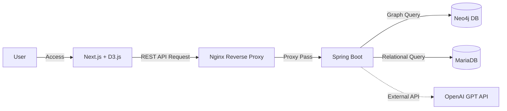

# 🏗️ ChatGraph - Backend
> **LLM 기반 대화 구조화 및 시각화 서비스**
> 
> 본 프로젝트의 백엔드는 고도화된 AI 모델(GPT)과 그래프 데이터베이스(Neo4j)를 연결하며, Docker 컨테이너 기반의 안정적인 인프라 환경에서 운영됩니다.

---

## 🛠 Tech Stack
* **Framework:** Java 17, Spring Boot 3.5.3
* **Database:** MariaDB (RDBMS), Neo4j (Graph DB)
* **Infra/DevOps:** **Docker**, **Docker-compose**, **Nginx** (Reverse Proxy)
* **AI:** OpenAI GPT API

---

## 🏗 System Architecture


---

## 🚀 Getting Started (실행 방법)

사용자의 로컬 환경이나 서버에서 프로젝트를 구동하기 위한 가이드입니다.

### 1. 저장소 복제 (Clone)
터미널을 열고 아래 명령어를 입력하여 프로젝트 소스 코드를 가져옵니다.
```bash
git clone [https://github.com/dku25-capstone/chatGraph-BE.git](https://github.com/dku25-capstone/chatGraph-BE.git)
cd chatGraph-BE
```

### 2. 환경 변수 설정 (.env)
프로젝트 루트 디렉토리에 `.env` 파일을 생성하고 아래 내용을 복사하여 설정합니다. 
(보안을 위해 실제 API Key와 비밀번호는 본인의 환경에 맞게 수정해야 합니다.)

```env
# --- [필수] 외부 API 및 보안 설정 ---
OPENAI_API_KEY=your_openai_api_key          # OpenAI API 발급 키
JWT_SECRET_KEY=your_generate_secret_key     # JWT 서명용 랜덤 문자열
JWT_EXPIRATION=1800000                      # 액세스 토큰 만료 시간 (30분)
JWT_REFRESH_EXPIRATION=2592000000           # 리프레시 토큰 만료 시간 (30일)

# --- [선택] 실행 프로파일 설정 ---
SPRING_PROFILES_ACTIVE=dev                  # 실행 환경 (dev 또는 prod)

# --- [DB] MariaDB 설정 ---
MARIADB_PORT=3306
MARIADB_ROOT_PASSWORD=root_password
MARIADB_DATABASE=user
MARIADB_USER=chatgraph
MARIADB_PASSWORD=your_password

# --- [DB] Neo4j 설정 ---
NEO4J_USERNAME=neo4j
NEO4J_PASSWORD_DEV=chatgraph                # Dev 환경용 비밀번호
NEO4J_PASSWORD=your_prod_password           # Prod 환경용 비밀번호
```

### 3. 컨테이너 빌드 및 실행 (Docker)
Docker-compose를 이용하여 백엔드 서버와 데이터베이스(MariaDB, Neo4j)를 한 번에 실행합니다.

```Bash
# 백그라운드 모드로 실행
docker-compose up -d
```

### 4. 실행 상태 확인
모든 컨테이너가 정상적으로 구동되었는지 확인합니다.

```Bash

# 컨테이너 상태 조회
docker ps

# 실시간 로그 확인 (필요 시)
docker-compose logs -f
```
Note: 서버가 가동되면 http://localhost:8080을 통해 API 요청을 처리할 수 있습니다.
